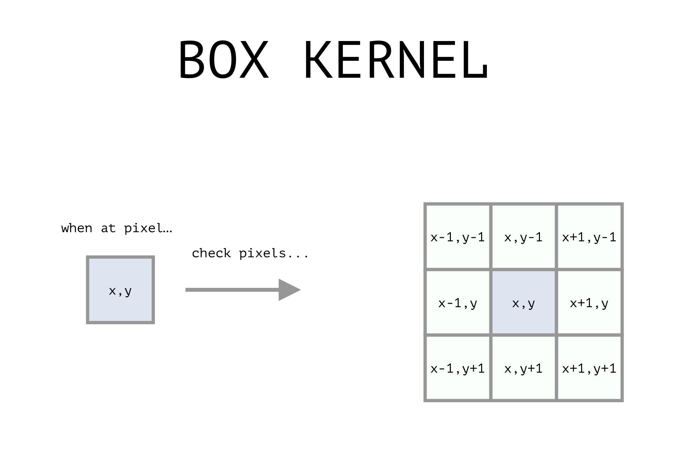

# Pillow image tutorials
Based on tutorials [here](https://www.codingame.com/playgrounds/2524/basic-image-manipulation/introduction)

## Transformations

### crop.py
1. Crop an image √√√
2. Crop an image into tiny images of 100x100 √√√

### scale.py
1. Scale an image (omg it looks so pixely, I love it) √√√

### flip.py
1. can flip an image across horizontal and/or vertical axis √√√

### rotate.py
1. can rotate about the center (not sure how this works. See inline comments for details). What's the math behind this???

## Colors

### Luminosity
1. Dim or brighten an image √√√
2. Luminosity as function of position in image √√√

### Contrast
- The contrast is the difference in brightness that makes the objects in an image distinguishable. See inline comments for more.
- Check out this resource for more info on a [real contrast algorithm](https://www.dfstudios.co.uk/articles/programming/image-programming-algorithms/image-processing-algorithms-part-5-contrast-adjustment/).

### Colorize!!!
I hope this is cool... "In the next example, we detect the pixels whose color is close to blue (0, 0, 255) by computing a distance, and we reduce the value of the red and blue components and increase the green component. What will this look like? Anything blue will become less blue, less red, and more green.

Try going in and changing the references `color_to_change = colors['green']` and `scalar = scalars['red']`.

It is really fun to experiment with the **color wheel** images and change the threshold.

#### Grayscale
1. Set all the pixel RGB values to their intensity

## Filtering

### Blur
1. box kernel (experiment w/ different sizes, make sketches of how it works)
2. gaussian kernel

### Sharpening (next time!)
1. use a high pass filter to boost pixels when the neighbor pixels are different
2. unsharp mask: remove the blurry part of the image

### Edge detection (next time!)
1. Sobel Operator: uses two kernels (horizontal, vertical) to detect edges

